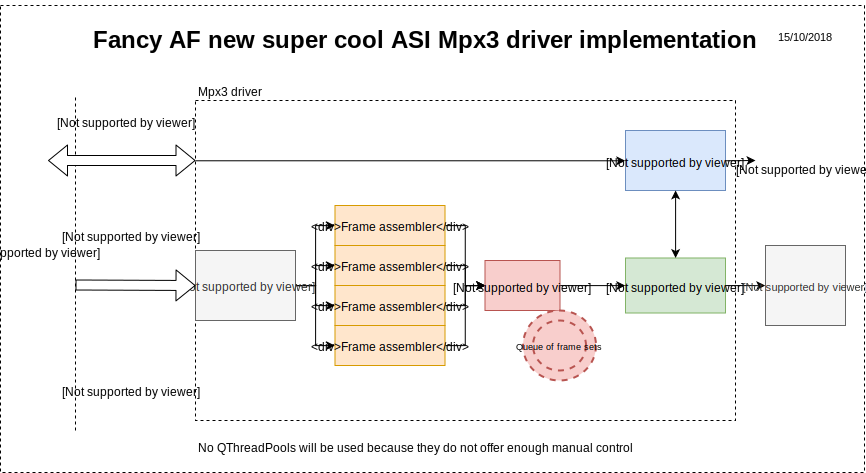

# New super cool amazing Medipix3 SPIDR driver

## Data flow diagram


## Ownership diagram
* Fill this in later

## Description
* This Receiver UDP Thread binds to ports 8192-8195 on a specified address (ANY by default) and receive packets from the UDP streams from the SPIDR/emulator.
* SpidrController and SpidrDaq are used to trigger readout as usual.
* As of 02/10/18, this is reading in packets, parsing them by their packet types (pSOF, pSOR, pEOR, pEOF, iSOR etc.) and putting them in a buffer. Next step is to integrate frame buffering and a framebuilder thread.

## Aim
* The idea is to just replace the existing driver classes that handle receiving the UDP packets and framebuilding - receiverThread, receiverThreadC, framebuilderThread and framebuilderThread.
* The interface to Dexter will be maintained unless necessary or it's much more efficient

## Build and run instructions
```
cd src/
qmake && make -j12 && make clean && ./TestMpx3Driver
```
This is friendly with QtCreator of course, no weird configurations are required

Generate and open documentation
```
cd doc/
generateAndOpenDocs.sh
```

## Dependencies
* Mostly standard Linux/Unix
* Qt (tested with 5.10 and 5.11, any recent version should work)
* Clang++ (can change this to g++ in the .pro file)
